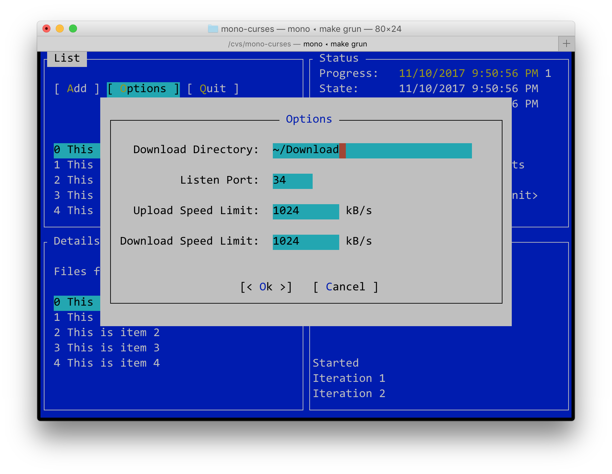

mono-curses
===========

This provides both a low-level API, as well as a simple console
UI toolkit called `gui.cs`.

The goal of this library was to bind curses.  There is a
low-level binding in binding.cs and a few chunks in handles.cs
that provide a basic abstraction.

The focus of this work though has been on a simple GUI toolkit
for writing desktop applications, inspired on the 15 year old
work that I did for the Midnight Commander (you can tell I
like those colors). 

The work in `gui' does not take advantage of curses "WINDOWS"
or the Panel library as am not familiar with them, instead we
create our own abstraction here. 

Example
=======

I recently added a neutered version of an old UI I did for MonoTorrent
that has the actual torrent code removed, but shows how to use
the gui.cs toolkit.

To run, just type `make grun`



License
=======

This is an ncurses binding licensed under the terms of the MIT X11
license.

Features
========

Detects window changes, invokes event for widgets to relayout if
the user wishes to.

Hotkeys (Alt-letter) are handled by buttons and a handful others.

Dialog boxes automatically get centered (even with window size change
scenarios).

Entry widget has emacs keybindings.

ListView widget uses Model/View setup.

Color and black and white support (first parameter to Application.Init)

Setup and Building
==================

To build, make sure that you run the configure script, where you can specify
an installation prefix, and then run make.   Like this:

```
$ configure 
$ make
```

The above defaults to installing in `/usr/local`, if you want to change that
use the `--prefix` flag, like this:

```
$ configure --prefix=/opt/mono-curses/my-install
$ make
```

Once you do a first build with the above, you can use the provided solution
file to rebuild.

Demo
====

You can see how to use the curses API by running the `test.exe`, which only shows
some letters on the screen with curses, or the `guitest.exe` which is a fake 
application using gui.cs

TODO for the tiny Gui.cs library
================================

I started an alternative version for gui.cs here:

	github.com/migueldeicaza/gui.cs

* Rename x,y,w,h into something better, expose rects?
* Merge Widget and Container?
* Add scrollbar and thumb to listviews
* Add text view widget
* Add scrollable control
* Checkbox/Radio button are missing
* Date/Time widget
* Process widget
* Command line parsing to demo (to active B&W support).
* Implement Layout managers, which?
* Write a manual/tutorial


